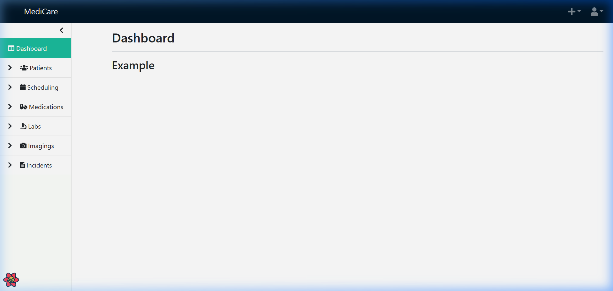
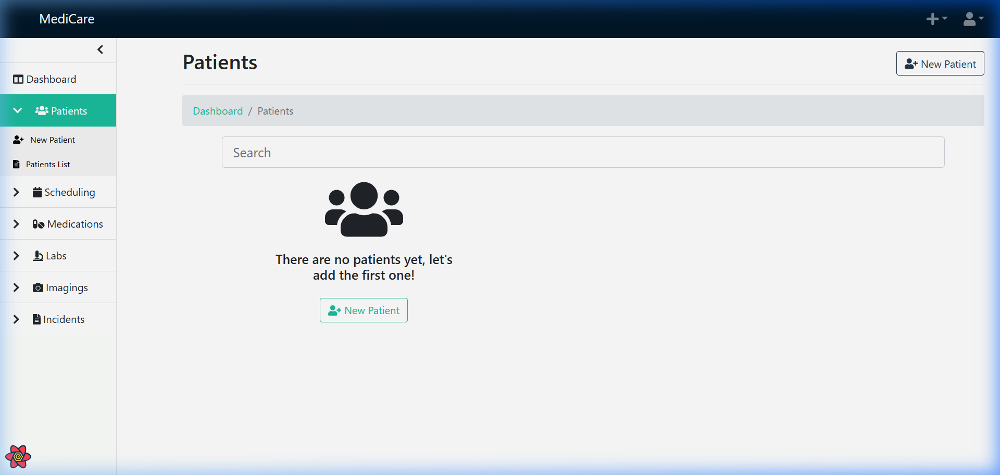
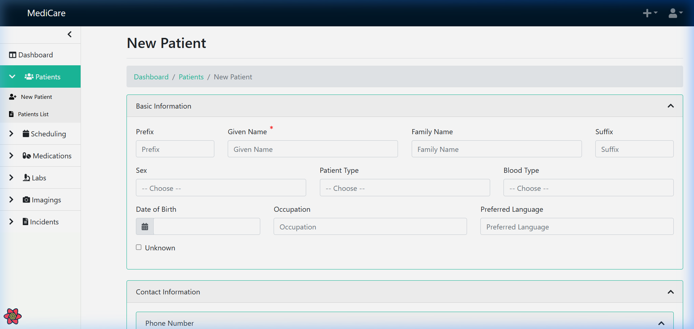

<div align="center">

# 🏥 MediCare Management System

### _Smart Healthcare. Modern Care. Better Outcomes._

**AI-Powered Healthcare Management Platform**

[](https://opensource.org/licenses/MIT)
[](https://reactjs.org/)
[](https://nodejs.org/)
[](https://redux.js.org/)
[](https://couchdb.apache.org/)
[](https://www.docker.com/)

---

🏆 **Designed for the Brainwave Hackathon**

👥 **Built by Team CODE CRASH**

👤 **Team Lead: PRAVEEN KUMAR JAYSWAL**

---

[Features](#-features) · [Architecture](#-architecture) · [Quick Start](#-quick-start) · [Modules](#-modules) · [Tech Stack](#-tech-stack) · [Contributing](#-contributing)

</div>

---

## 📸 Application Screenshots

### Dashboard


### Patients Registry


### New Patient Registration


---

## ✨ Features

| Module | Description |
|--------|-------------|
| 🏠 **Dashboard** | Real-time analytics with patient statistics, appointment summaries, and system health monitoring |
| 👨‍⚕️ **Patient Management** | Comprehensive patient records, demographics, medical history, and care coordination |
| 📅 **Appointment Scheduling** | Smart scheduling with conflict detection, reminders, and calendar integration |
| 💊 **Medication Management** | Prescription tracking, drug interaction alerts, and pharmacy coordination |
| 🔬 **Lab Management** | Lab order creation, result tracking, and diagnostic report generation |
| 🩺 **Imaging** | Medical imaging requests, DICOM viewer integration, and radiology workflows |
| 🚨 **Incident Reporting** | Safety incident tracking, investigation workflows, and compliance reporting |
| 📊 **Care Plans & Goals** | Personalized care plans, goal tracking, and outcome measurement |
| 👥 **Related Persons** | Family and emergency contact management with relationship tracking |
| 🏥 **Visit Management** | Inpatient/outpatient visit tracking, admission/discharge workflows |
| 📝 **Clinical Notes** | Structured clinical documentation with templates and voice-to-text support |
| ⚙️ **Settings** | Multi-language support, user preferences, and system configuration |

---

## 🏗️ Architecture

```
┌─────────────────────────────────────────────────────────┐
│                    MediCare Frontend                     │
│     React 17 · Node.js · Redux Toolkit · Bootstrap 5    │
├─────────────────────────────────────────────────────────┤
│              PouchDB (Offline-First Sync)                │
├─────────────────────────────────────────────────────────┤
│                  Apache CouchDB Backend                  │
│          (RESTful API · Document Database)                │
└─────────────────────────────────────────────────────────┘
```

### Key Architectural Decisions

- **Offline-First**: PouchDB enables full offline functionality with automatic sync
- **Relational Documents**: Uses `relational-pouch` for structured document relationships
- **Role-Based Access**: Granular permissions system for different user roles
- **i18n Ready**: Full internationalization support with i18next
- **Progressive Web App**: Installable on desktop and mobile devices

---

## 🚀 Quick Start

### Prerequisites

- **Node.js** >= 14.x
- **npm** >= 6.x
- **Docker** & **Docker Compose** (for CouchDB)

### Installation

```bash
# 1. Clone the repository
git clone https://github.com/Praveen-kumar625/MediCare-Management-System-.git

# 2. Navigate to the frontend directory
cd MediCare-Management-System-/frontend

# 3. Install dependencies
npm install

# 4. Start CouchDB with Docker
# On Windows:
./couchdb/couchdb-init.bat
# On macOS/Linux:
./couchdb/couchdb-init.sh

# 5. Create .env file
echo "REACT_APP_MEDICARE_API=http://localhost:5984" > .env

# 6. Start the development server
npm start
```

The application will be available at `http://localhost:3000`

### Default Login Credentials

| Role | Username | Password |
|------|----------|----------|
| Admin | `admin` | `password` |
| User | `username` | `password` |

---

## 📦 Modules

### Folder Structure

```
frontend/
├── public/                    # Static assets, favicon, manifest
├── src/
│   ├── dashboard/             # Dashboard analytics & widgets
│   ├── imagings/              # Medical imaging module
│   ├── incidents/             # Incident reporting & tracking
│   ├── labs/                  # Laboratory management
│   ├── medications/           # Medication & prescription management
│   ├── page-header/           # Breadcrumbs, title, button toolbar
│   ├── patients/              # Patient management
│   │   ├── care-goals/        # Care goals tracking
│   │   ├── diagnoses/         # Diagnosis management
│   │   ├── edit/              # Patient editing
│   │   ├── new/               # New patient registration
│   │   ├── notes/             # Clinical notes
│   │   ├── related-persons/   # Related persons management
│   │   ├── search/            # Patient search
│   │   ├── view/              # Patient view
│   │   └── visits/            # Visit management
│   ├── scheduling/            # Appointment scheduling
│   ├── settings/              # System settings
│   ├── shared/                # Shared utilities & components
│   │   ├── components/        # Reusable UI components
│   │   ├── config/            # App configuration (PouchDB, i18n)
│   │   ├── db/                # Database repositories
│   │   ├── hooks/             # Custom React hooks
│   │   ├── locales/           # Translation files (i18n)
│   │   ├── model/             # Data models
│   │   ├── store/             # Redux store configuration
│   │   └── util/              # Utility functions
│   └── user/                  # User authentication & management
├── couchdb/                   # CouchDB Docker configuration
├── docs/                      # Project documentation
├── scripts/                   # Build & utility scripts
├── docker-compose.yml         # Docker compose for development
├── package.json               # Project dependencies
└── jsconfig.json              # Compiler configuration
```

---

## 🛠️ Tech Stack

| Category | Technology |
|----------|-----------|
| **Frontend Framework** | React 17 |
| **Backend / Runtime** | Node.js |
| **State Management** | Redux Toolkit + Redux Thunk |
| **UI Components** | Bootstrap 5 + Custom Component Library |
| **Database (Client)** | PouchDB with Offline-First Architecture |
| **Database (Server)** | Apache CouchDB |
| **Routing** | React Router DOM v5 |
| **Internationalization** | i18next + react-i18next |
| **Data Fetching** | React Query |
| **Testing** | Jest + React Testing Library |
| **Linting** | ESLint (Airbnb config) + Prettier |
| **CSS** | SCSS + Bootstrap |
| **Build Tool** | Create React App |
| **Containerization** | Docker + Docker Compose |
| **CI/CD** | GitHub Actions + Azure Pipelines |

---

## 🔒 Security

- **Role-Based Access Control (RBAC)** with granular permissions
- **CouchDB Authentication** with session management
- **CORS** properly configured
- **Content Security Policy** headers via Nginx
- **Offline data encryption** through PouchDB
- **CodeQL** static analysis integrated

---

## 🌐 Deployment

### Docker

```bash
# Build and run with Docker Compose
docker-compose up --build

# Access the application
# Frontend: http://localhost:80
# CouchDB Admin: http://localhost:5984/_utils
```

### Production Build

```bash
npm run build
# Serve the build/ directory with Nginx or any static file server
```

---

## 🧪 Testing

```bash
# Run all tests
npm test

# Run tests in CI mode
npm run test:ci

# Run with coverage
npm run coveralls

# Lint code
npm run lint

# Fix lint issues
npm run lint:fix
```

---

## 🗺️ Roadmap

- [ ] AI-powered diagnostic suggestions
- [ ] Telemedicine video consultation integration
- [ ] Advanced analytics dashboard with ML insights
- [ ] Mobile-native application (React Native)
- [ ] HL7 FHIR compliance
- [ ] E-prescription integration
- [ ] Billing and invoicing module
- [ ] Pharmacy inventory management
- [ ] Blood bank management
- [ ] Integration with wearable health devices

---

## 📈 Performance

- **Offline-First Architecture** — Full functionality without internet
- **Lazy Loading** — Code splitting for optimal bundle sizes
- **Service Workers** — PWA caching for instant load times
- **Optimistic UI Updates** — Immediate user feedback
- **Incremental Sync** — Efficient data synchronization with CouchDB

---

## 🤝 Contributing

We welcome contributions! Please see our [Contributing Guide](.github/CONTRIBUTING.md) for details.

1. Fork the repository
2. Create your feature branch (`git checkout -b feature/amazing-feature`)
3. Commit your changes (`git commit -m 'Add amazing feature'`)
4. Push to the branch (`git push origin feature/amazing-feature`)
5. Open a Pull Request

---

## 📄 License

This project is licensed under the **MIT License** — see the [LICENSE](LICENSE) file for details.

---

## 🙏 Acknowledgements

- **Brainwave Hackathon** — For providing the platform and inspiration
- **Team CODE CRASH** — For the collaborative effort and innovation
- **Praveen Kumar Jayswal** — Team Lead & Project Architect
- **Open Source Community** — For the amazing tools and libraries

---

<div align="center">

### 🏆 Brainwave Hackathon 2026

**Designed & Developed by Team CODE CRASH**

**Team Lead: Praveen Kumar Jayswal**

---

_MediCare Management System — Transforming Healthcare Through Technology_

**© 2026 Team CODE CRASH. All rights reserved.**

Built with ❤️ for the Brainwave Hackathon

</div>
